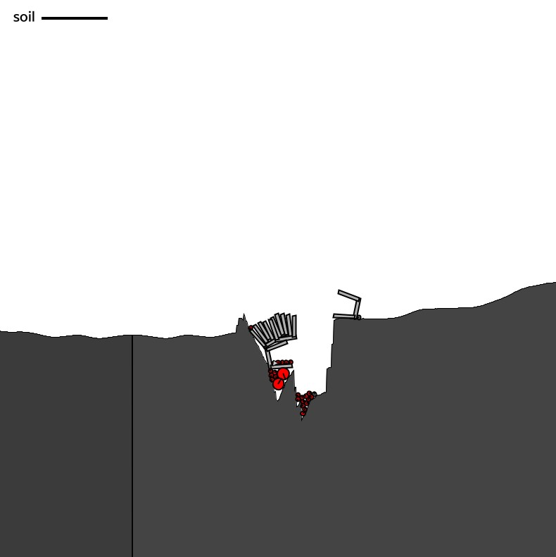

# 샌드박스형 무한맵 게임

- Processing과 Box2D 라이브러리를 이용한 프로젝트

## 작동 예시 사진

- 이런식으로 창이 떠요

## 규칙

- 바퀴를 굴리거나, 점프할 수 있습니다.
- 입자를 쏘거나, 양동이를 소환하거나, 땅을 파고 덮을 수 있습니다.
    - 이는 soil이 있어야 가능합니다.
    - soil은 땅을 파서 얻습니다.
    - 입자는, 10초 후 사라집니다.

## 작동방법

- space bar: jump
- Left arrow: Roll to the left
- Right arrow: Roll to the right
- Q/q: throw partile (it's lifespan is 10s)
- W/w: throw bucket
- D/d: dig the land
- F/f: fill up the land
- R/r: respawn the car